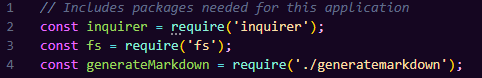
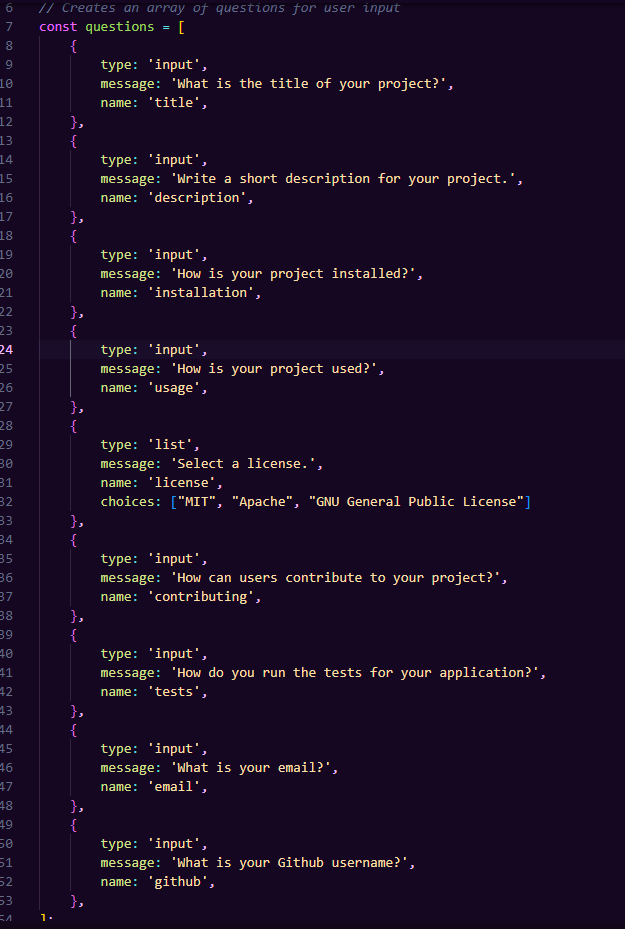
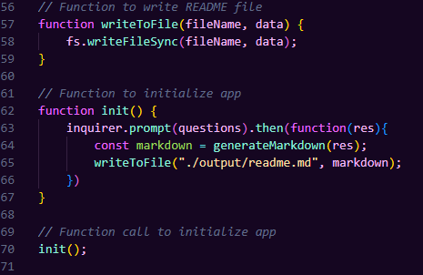
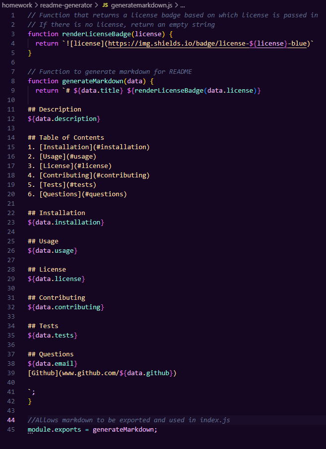

# readme-generator 

## Description
Generates a professional readme template for use in projects! App runs using Node.js

## Table of Contents
1. [Installation](#installation)
2. [Usage](#usage)
3. [License](#license)
4. [Contributing](#contributing)
5. [Tests](#tests)
6. [Questions](#questions)

## Installation
Users can install the application via Github.

## Usage
Users can run the application in the console. They wil be asked a series of prompts to generate a readme to their liking.

Code block includes packages needed for application to run (Inquirer and FS).  

Code block that contains the array of questions for the user to answer. Questions are prompted using Inquirer. The license section requires a selection rather than a text input, and includes limited options to avoid invalid licensing.

Code block that takes users input/answers and generates them into a readme file using FS writeFile. 
**           **
<b>IMPORTANT</b>:  
The code is currently set up to output the readme file into a temporary "output" folder. Users can either move the file location OR change the code in line 65 to output the
readme file into their desired location.
**           ** 

This is a screencap of the generatemarkdown.js file. It holds the template for the readme before any user input is added. Read previous screenshot to learn more about where the output is stored.

## License
MIT

MIT License Copyright ©️ 
https://mit-license.org/

## Contributing
Users can contribute via Github branching.

## Tests
N/A

## Questions
derekjmedrano@gmail.com  
[Github](www.github.com/derekmedrano)